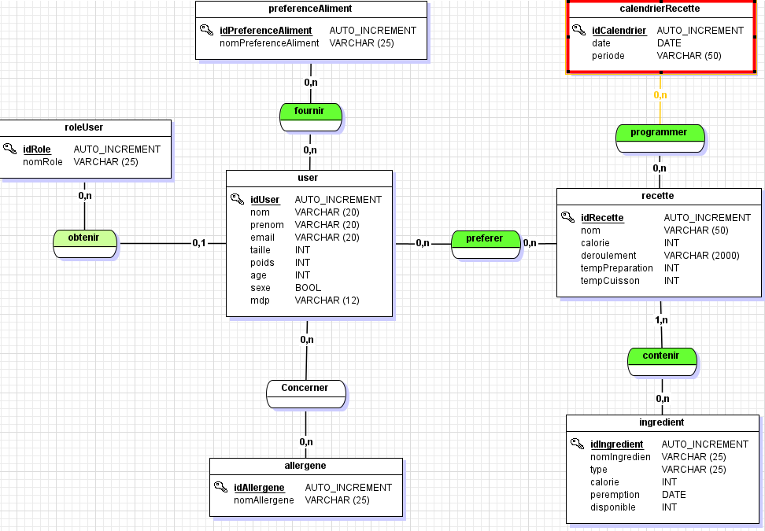
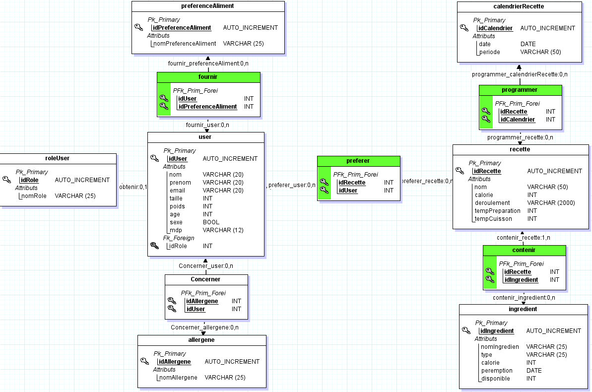

# orgamenu
back d'une application web d'organisation des menus de la semaine 
  
On enregistre sa recherche afin qu'il puisse la revoir ultérieurement et le renvoie sur le site d'achat.

***

## __Fonctionnement__:

### useCase

### MCD

### MLD

***

## __End-points__:

- http://localhost:8080/orgamenu

> Page d'acceil du site
        
        

## __Exemple de requetes__: 

changer créer model etape des recettes
